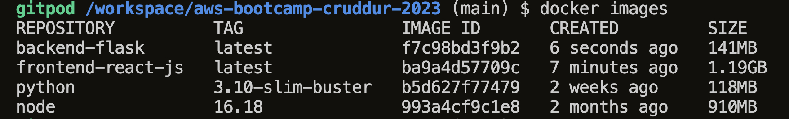

# Week 1 — App Containerization


To start docker with environment variables, we use
~~~
FRONTEND_URL="*" BACKEND_URL="*" 

build docker image for the backend with:

docker build -t  backend-flask ./backend-flask


To run docker with environment variables, use the following:

docker run -p 4567:4567 -e FRONTEND_URL='*' -e BACKEND_URL='*'  backend-flask
~~~

Created a docker file for the frontend React js application and ran the following docker command to build the docker image for the frontend
~~~
docker build -t frontend-react-js ./rontend-react-js
~~~

Run the frontend app with :
~~~
docker run -p 3000:3000 -d frontend-react-js
~~~


Ran npm command to install all needed dependences need to run node as well npm audit for fix potential vulnerabilities.
~~~
npm install 
npm audit fix --force
~~~

with all the images created, the output of docker images will like what's been build 



Docker files for Backend python 
~~

backend-flask/Dockerfile
FROM python:3.10-slim-buster
WORKDIR /backend-flask
COPY requirements.txt requirements.txt
RUN pip3 install -r requirements.txt
COPY . .
ENV FLASK_ENV=development
EXPOSE ${PORT}
CMD [ "python3", "-m" , "flask", "run", "--host=0.0.0.0", "--port=4567"]

~~
Dockerfile for frontend react is shown below:
~~~
frontend-react-js/Dockerfile
FROM node:16.18
ENV PORT=3000
COPY . /frontend-react-js
WORKDIR /frontend-react-js
RUN npm install
EXPOSE ${PORT}
CMD ["npm", "start"]`
~~~

## Update the Notification Endpoints

created a new endpoint for notification frontend
~~~
/api/activities/notifications:
    get:
      description: 'Return a feed of activity for all of those that I follow'
      tags:
        - activities
      parameters: []
      responses:
        '200':
          description: Returns an array of activities
          content:
            application/json:
              schema:
                type: array
                items:
                  $ref: '#/components/schemas/Activity'
~~~


backend code change for notification in 
~~~
#added route
@app.route("/api/activities/notifications", methods=['GET'])
def data_notification():
  data = NotificationsActivities.run()
  return data, 200
~~~

Added new activity for the above route
~~~
from datetime import datetime, timedelta, timezone
class NotificationsActivities:
  def run():
    now = datetime.now(timezone.utc).astimezone()

    results = [{
      'uuid': '68f126b0-1ceb-4a33-88be-d90fa7109eee',
      'handle':  'twinkle starlight',
      'message': 'The stars are very JAFFY!',
      'created_at': (now - timedelta(days=2)).isoformat(),
      'expires_at': (now + timedelta(days=5)).isoformat(),
      'likes_count': 5,
      'replies_count': 1,
      'reposts_count': 0,
      'replies': [{
        'uuid': '26e12864-1c26-5c3a-9658-97a10f8fea67',
        'reply_to_activity_uuid': '68f126b0-1ceb-4a33-88be-d90fa7109eee',
        'handle':  'Worf',
        'message': 'This post has no honor!',
        'likes_count': 0,
        'replies_count': 0,
        'reposts_count': 0,
        'created_at': (now - timedelta(days=2)).isoformat()
      }],
    },
    ]
    return results
~~~


Wrote frontend Notification component for react frontend
~~~
import './NotificationFeedPage.css';
import React from "react";

import DesktopNavigation  from '../components/DesktopNavigation';
import DesktopSidebar     from '../components/DesktopSidebar';
import ActivityFeed from '../components/ActivityFeed';
import ActivityForm from '../components/ActivityForm';
import ReplyForm from '../components/ReplyForm';

// [TODO] Authenication
import Cookies from 'js-cookie'

export default function NotificationsFeedPage() {
  const [activities, setActivities] = React.useState([]);
  const [popped, setPopped] = React.useState(false);
  const [poppedReply, setPoppedReply] = React.useState(false);
  const [replyActivity, setReplyActivity] = React.useState({});
  const [user, setUser] = React.useState(null);
  const dataFetchedRef = React.useRef(false);

  const loadData = async () => {
    try {
      const backend_url = `${process.env.REACT_APP_BACKEND_URL}/api/activities/notifications`
      const res = await fetch(backend_url, {
        method: "GET"
      });
      let resJson = await res.json();
      if (res.status === 200) {
        setActivities(resJson)
      } else {
        console.log(res)
      }
    } catch (err) {
      console.log(err);
    }
  };

  const checkAuth = async () => {
    console.log('checkAuth')
    // [TODO] Authenication
    if (Cookies.get('user.logged_in')) {
      setUser({
        display_name: Cookies.get('user.name'),
        handle: Cookies.get('user.username')
      })
    }
  };

  React.useEffect(()=>{
    //prevents double call
    if (dataFetchedRef.current) return;
    dataFetchedRef.current = true;

    loadData();
    checkAuth();
  }, [])

  return (
    <article>
      <DesktopNavigation user={user} active={'notifications'} setPopped={setPopped} />
      <div className='content'>
        <ActivityForm  
          popped={popped}
          setPopped={setPopped} 
          setActivities={setActivities} 
        />
        <ReplyForm 
          activity={replyActivity} 
          popped={poppedReply} 
          setPopped={setPoppedReply} 
          setActivities={setActivities} 
          activities={activities} 
        />
        <ActivityFeed 
          title="Notifications" 
          setReplyActivity={setReplyActivity} 
          setPopped={setPoppedReply} 
          activities={activities} 
        />
      </div>
      <DesktopSidebar user={user} />
    </article>
  );
}
~~~

## DynamoDN & Postgress changes
Added a local docker dynamodb to the docker-compose.yml file

~~~
dynamodb-local:
    # https://stackoverflow.com/questions/67533058/persist-local-dynamodb-data-in-volumes-lack-permission-unable-to-open-databa
    # We needed to add user:root to get this working.
    user: root
    command: "-jar DynamoDBLocal.jar -sharedDb -dbPath ./data"
    image: "amazon/dynamodb-local:latest"
    container_name: dynamodb-local
    ports:
      - "8000:8000"
    volumes:
      - "./docker/dynamodb:/home/dynamodblocal/data"
    working_dir: /home/dynamodblocal

~~~

Added postgresql to docker-compose.yml file

~~~
db:
    image: postgres:13-alpine
    restart: always
    environment:
      - POSTGRES_USER=postgres
      - POSTGRES_PASSWORD=password
    ports:
      - '5432:5432'
    volumes: 
      - db:/var/lib/postgresql/data
~~~

Added the posrgresql client driver to Gitpod.yml

~~~
db:
    image: postgres:13-alpine
    restart: always
    environment:
      - POSTGRES_USER=postgres
      - POSTGRES_PASSWORD=password
    ports:
      - '5432:5432'
    volumes: 
      - db:/var/lib/postgresql/data
      
volumes:
  db:
    driver: local
~~~

Tested connectivity from the client to the postgresql instance with 
~~~
psql -h localhost --u postgres
# user is prompted for password 
~~~
also tested from the  IDE using the vscode extention for postgresql


tested the setup by bringing up the application with 
```
docker-compose up
```

## Home work challange
Run the docker file CMD as an external script
created a make file and added the following into it
usage: make npm build run to insall npm, docker and start the app
~~~
.PHONY: npm
npm:
	cd frontend-react-js; npm i 
	cd ..

build:
	echo "building froment reack docker image"
	docker build -t  backend-flask ./backend-flask
	echo "building backend python docker image"
	docker build -t frontend-react-js ./frontend-react-js


run:
	echo "starting app"
	docker run --rm -p 4566:4567 -it -d -e FRONTEND_URL='*' -e BACKEND_URL='*' backend-flask
	docker run -p 3000:3000 -d frontend-react-js

stop:
	echo "stopping running containers"
	docker container stop $(docker container ls -aq)

clean:
	echo "removing all docker images"
	docker image rmi -f $(docker image ls -aq)
~~~

## Push and tag an image to DockerHub
steps
1. create a repository for the image in Dockerhub
2. build image from Dockerfile
3. tag image with name of repo created in dockerhub
~~~
used the backend-flask image
docker build -t jbackend .
docker image tag jbackend wokoci/awsprojcamp:latest
docker push wokoci/awsprojcamp:latest
~~~
image of image after build and tag


docker hub showing pushed image


## Use multi-stage building for a Dockerfile build  && tag the push 
Backend-flask with updated to use the following multi-stage dockerfile
~~~
# Stage 1: Base stage
FROM python:3.10-slim-buster as base
WORKDIR /backend-flask
COPY requirements.txt requirements.txt
RUN pip3 install -r requirements.txt

# Stage 2: Development stage
FROM base as development
COPY . .
ENV FLASK_ENV=development
EXPOSE ${PORT}
CMD [ "python3", "-m", "flask", "run", "--host=0.0.0.0", "--port=4567"]

# Stage 3: Production stage
FROM base as production
COPY . .
CMD [ "python3", "-m", "flask", "run", "--host=0.0.0.0", "--port=4567"]
~~~

Tag and push my branch
~~~
git push multistage
git push origin main  multistage
~~~

### Add healthcehck to docker-compose file
added the following to the frontend-react section of the docker compose file
~~~
 healthcheck:
          test: curl --fail https://3000-wokoci-awsbootcampcrudd-pkk2usccdco.ws-eu89.gitpod.io/ || exit 1
          interval: 60s
          retries: 5
          start_period: 20s
          timeout: 10s  
~~~

### Best practices for Dockerfile
Done some research of best practices from the docker documentation

installed docker with the docker mac installer


built the backend docker file locally and ran on my laptop


